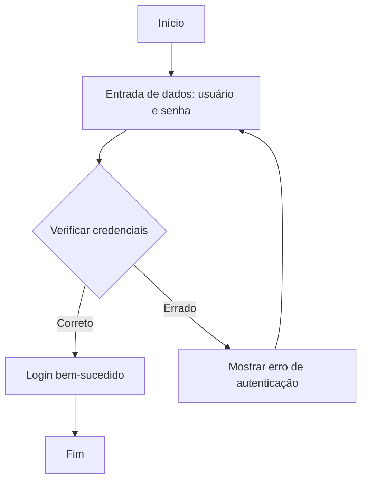

### 1. Exercício 1: Escreva uma descrição clara e concisa sobre o processo de instalação de um software de sua escolha, evitando frases longas e jargões desnecessários.

**Instalação do Visual Studio Code no Windows:**

1. Acesse o site oficial do Visual Studio Code.
2. Baixe o instalador para Windows.
3. Execute o instalador e siga as instruções na tela.
4. Após a instalação, abra o Visual Studio Code.

### 2. Exercício 2: Reescreva o parágrafo abaixo de forma mais objetiva e direta:

**Parágrafo original:**
"O sistema permite que os usuários façam upload de arquivos, que serão armazenados no servidor para que, posteriormente, os administradores possam acessá-los."

**Versão reescrita:**
"O sistema permite que os usuários façam upload de arquivos para armazenamento no servidor, acessível posteriormente pelos administradores."

### 3. Exercício 3: Organize a seguinte lista de instruções usando títulos, subtítulos e listas ordenadas:

**Instalação e Configuração do Node.js**

1. **Instalar o Node.js**

   - Acesse o site oficial do Node.js.
   - Baixe a versão LTS recomendada para o seu sistema operacional.
   - Execute o instalador e siga as instruções na tela.

2. **Configurar o ambiente com variáveis de ambiente**

   - Verifique se o Node.js e o npm foram corretamente instalados, digitando os seguintes comandos no terminal:
     ```bash
     node -v
     npm -v
     ```
   - Caso não esteja configurado corretamente, adicione o caminho do Node.js às variáveis de ambiente do sistema.

3. **Testar a instalação com um comando no terminal**

   - Para testar se a instalação foi bem-sucedida, execute:
     ```bash
     node -v
     npm -v
     ```
   - Se ambos os comandos retornarem versões, a instalação foi bem-sucedida.

4. **Criar um novo projeto utilizando `npm init`**
   - No terminal, navegue até o diretório desejado e execute o comando:
     ```bash
     npm init
     ```
   - Siga as instruções para configurar o projeto.

### 4. Exercício 4: Crie um exemplo de código que ilustre uma função simples (pode ser em qualquer linguagem de programação) e inclua-o em uma explicação sobre como essa função pode ser utilizada.

**Exemplo de código em Python:**

```python
def saudacao(nome):
    return f"Olá, {nome}!"

# Como usar a função:
nome = "João"
mensagem = saudacao(nome)
print(mensagem)
```

**Explicação:**
A função `saudacao` recebe um nome como argumento e retorna uma saudação personalizada. Neste exemplo, ao chamar a função com o nome "João", ela retorna a mensagem "Olá, João!" e a imprime no console.

### 5. Exercício 5: Crie um diagrama de fluxo que represente o processo de login em um sistema (entrada de dados, verificação, sucesso/erro).

**Diagrama de Fluxo do Processo de Login:**



**Explicação:**

- O processo começa com a entrada de dados (usuário e senha).
- Em seguida, o sistema verifica as credenciais.
- Se as credenciais estiverem corretas, o login é bem-sucedido.
- Se as credenciais estiverem erradas, o sistema exibe uma mensagem de erro e solicita a entrada dos dados novamente.
- O processo termina quando o login é bem-sucedido ou o erro é corrigido.
